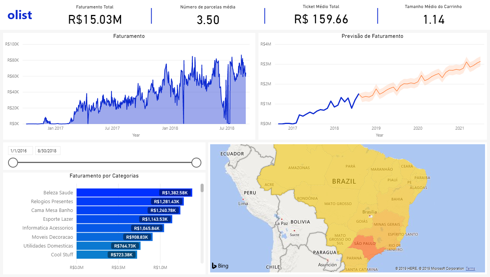
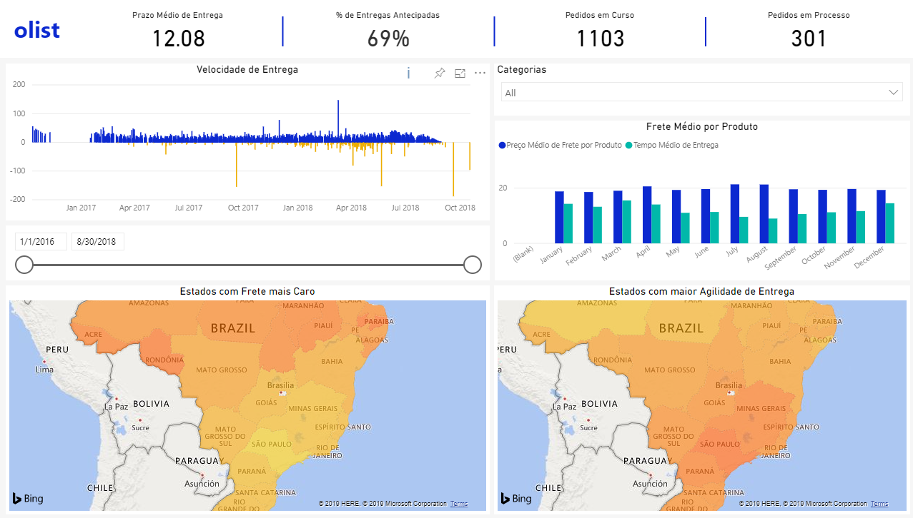

# Olist Analysis

#### What is Olist?

> Olist is a great sales channel totally different from what you have seen: our mega store is present in the main marketplaces in Brazil and is formed by thousands of other retailers like you. Our mission is to strengthen trade and make your products more competitive, increasing the chances of you selling more.
> _
- olist.com
_

 
 

- This analysis use the open data from Olist that can be found in Kaggle in this [link](https://www.kaggle.com/olistbr/brazilian-ecommerce). Through the dataset was possible build a great Business Inteligence about the Sales, Deliveries and the Satisfaction of the clientes in all Brazil.
- The visualizations was made in Power BI
- Some prediction was built using Python library StatsModels, using a moving average function, ARIMA.

 
 

<h4 style="text-align: center">Revenues</h4>

 
 

<h4 style="text-align: center">Sales</h4>

 
 

<h4 style="text-align: center">Deliveries</h4>

 
 

<h4 style="text-align: center">Satisfaction</h4>

 
 
 
 
Developed by Anderson Laurentino @ 2019