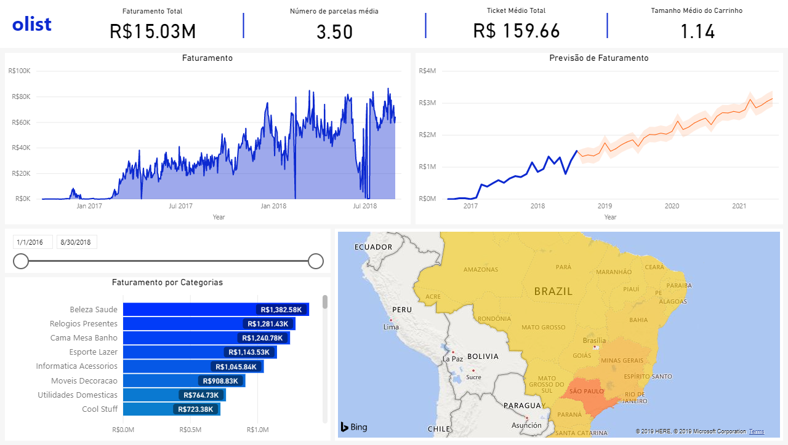
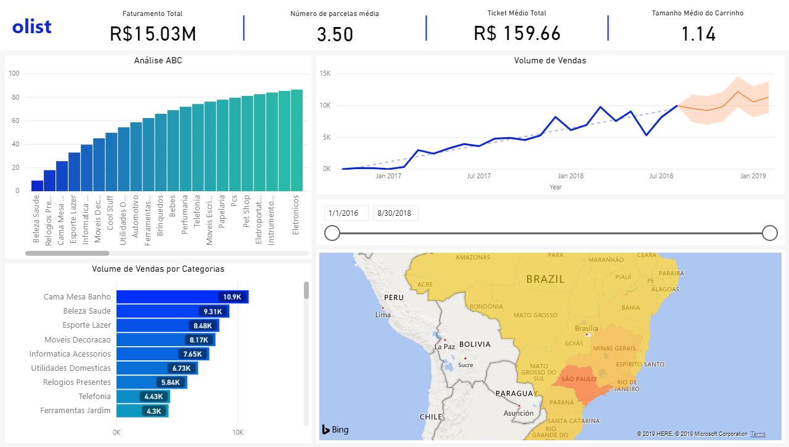
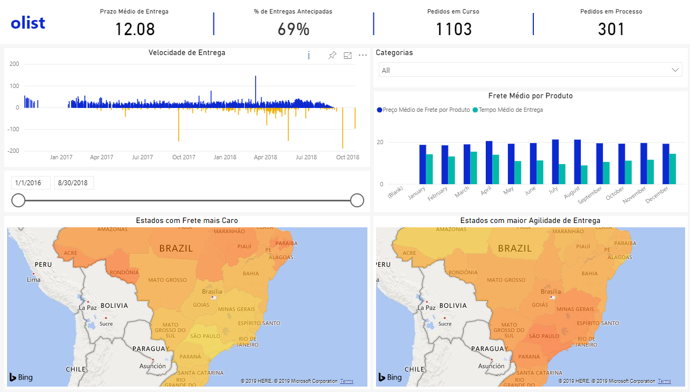
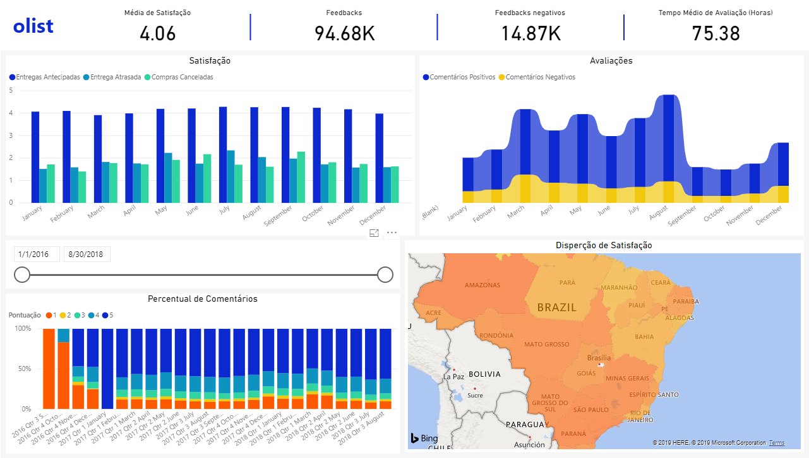

# Olist Analysis
---

#### O que é Olist?

> O olist é um grande canal de vendas totalmente diferente do que você já viu: nossa mega loja está presente nos principais marketplaces do Brasil e é formada por milhares de outros lojistas como você. Nossa missão é fortalecer o comércio e tornar seus produtos mais competitivos, aumentando as chances de você vender mais.
> _
- olist.com
_

 
 

- Esta análise utiliza os dados abertos da Olist que podem ser encontrados no Kaggle neste [link](https://www.kaggle.com/olistbr/brazilian-ecommerce). Desta forma foi possível criar visualizações sobre o desempenho de vendas, satifação com os cosumidores e entregas em todo o Brasil.
- As visualizações foram feitas utilizando o Power BI.
- Algumas predições foram feitas utilizando a biblioteca StatsModels implemetada em Python, utilizando a função de média movél, ARIMA.

 
 

### Faturamento

 
 

### Vendas

 
 

### Entregas

 
 

### Satisfação

 
 
 
 
Developed by Anderson Laurentino @ 2019